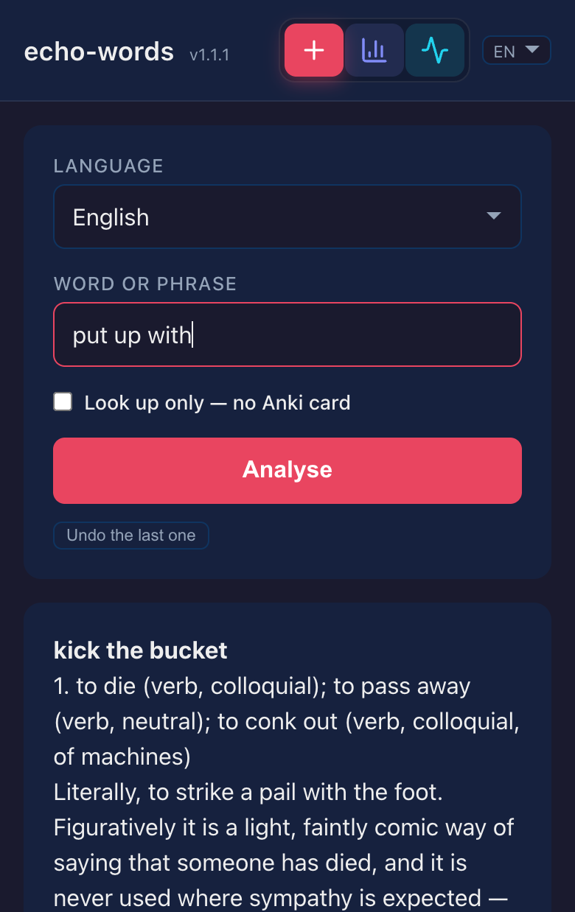
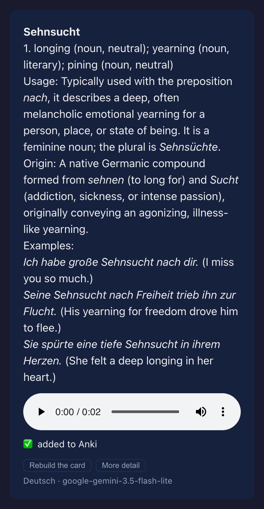
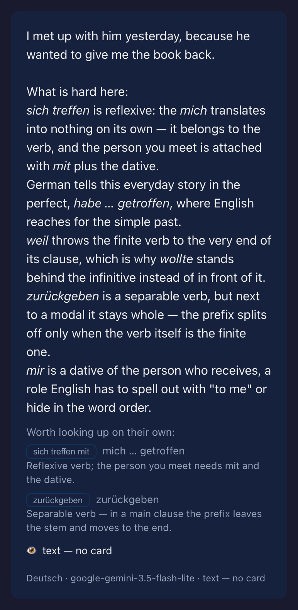

[](https://github.com/andgineer/echo-words/actions)
[](https://htmlpreview.github.io/?https://github.com/andgineer/echo-words/blob/python-coverage-comment-action-data/htmlcov/index.html)
# echo-words

A private vocabulary tutor for every word you meet. Send a word, a phrase or a
whole sentence, and echo-words explains what a dictionary will not: every sense
with its register, how the word is really used, where it comes from, examples
worth copying. Then it writes the flashcard for you — in both directions, with
a real voice reading the word aloud — into the Anki deck you already review. It
explains; Anki makes you remember.

<table>
<tr>
<td align="center" valign="top"><sub><b>A word, a phrase, a sentence</b></sub><br/></td>
<td align="center" valign="top"><sub><b>Analysis, audio, card in Anki</b></sub><br/></td>
<td align="center" valign="top"><sub><b>A sentence, translated and explained</b></sub><br/></td>
</tr>
</table>

What one word gets you:

* **an explanation, not a translation** — every sense with its part of speech
  and register, the collocations and prepositions the word takes, what it is
  confused with, its origin, and examples with their translations; an idiom or
  a phrase is explained whole, never taken apart
* **a card built for review, not a word→translation pair** — recognition and
  recall, unrelated senses kept apart, a gapped example so the reverse card
  asks a real question, and the pronunciation inside the note
* **a real voice, not a robot** — natural-sounding audio, in the app and on the
  card
* **a whole sentence gets a lesson instead** — translated, with what is hard in
  it explained, and the expressions worth learning offered as cards of their own
* **a deeper entry when you want one** — one tap re-asks the strongest model for
  a lexicographer's article: every sense including the rare ones, etymology in
  depth, near-synonyms, the mistakes learners make
* **nothing to pay** — a pool of free LLM providers answers; a paid model is
  optional and capped

# Documentation

[echo-words](https://andgineer.github.io/echo-words/)

<details>
<summary><b>Development</b></summary>

```bash
uv sync
npm --prefix webapp ci
inv dev     # http://127.0.0.1:8080
inv test    # Python + frontend suites
inv pre     # ruff, ruff-format, pyrefly, file hygiene
```

`inv test` silently skips the frontend suite when `webapp/node_modules` is
missing, so `npm ci` is part of the setup, not an optional extra. Never call
Ruff directly — `inv pre` is the only gate that matches CI.

Deployment is `invoke` over ssh, and the frontend is built on the VM by the
deploy itself:

```bash
inv setup-app --with-host-prep   # one-time, idempotent
inv deploy --ref=main
inv status
inv logs
```

See [Development](https://andgineer.github.io/echo-words/development/) and
[Deploy to Oracle Cloud](https://andgineer.github.io/echo-words/deploy-oracle/)
in the docs.

## Reports

* [Allure test report](https://andgineer.github.io/echo-words/builds/tests/)

</details>

> Created with cookiecutter using [template](https://github.com/andgineer/cookiecutter-python-package)
