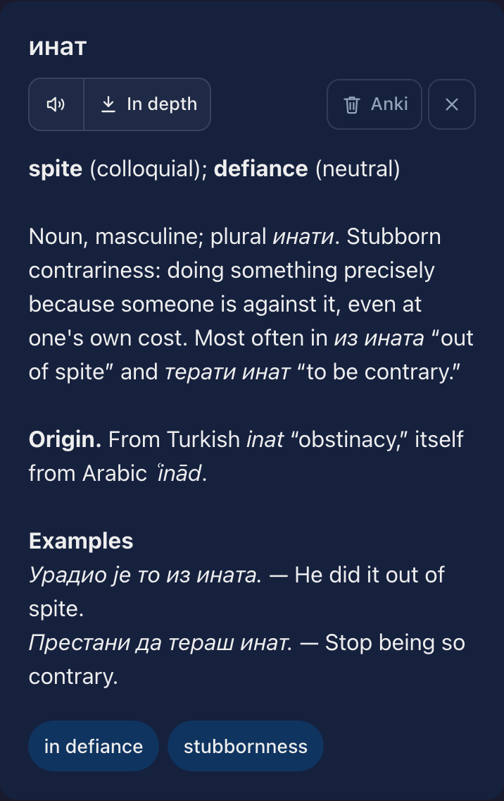

[](https://github.com/andgineer/echo-words/actions)
[](https://htmlpreview.github.io/?https://github.com/andgineer/echo-words/blob/python-coverage-comment-action-data/htmlcov/index.html)
# echo-words

A private, tailnet-only vocabulary assistant. Send a word — get a linguistic
analysis, hear it, and find the card already waiting in your Anki deck.

<table>
<tr>
<td align="center" valign="top"><sub><b>A word, or a phrase to pick from</b></sub><br/></td>
<td align="center" valign="top"><sub><b>Analysis, pronunciation, card</b></sub><br/></td>
<td align="center" valign="top"><sub><b>Any language, any script</b></sub><br/></td>
</tr>
</table>

Typing the word is the whole workflow:

* the analysis streams in while you read it — translations, senses, usage,
  origin, and examples with their translations
* the pronunciation is there when it finishes
* the note is already in that language's own Anki deck, deduplicated and synced
* share text from any iOS app and pick the word out of it
* no connection? the word waits in a queue and sends itself later

# Documentation

[echo-words](https://andgineer.github.io/echo-words/)

<details>
<summary><b>Development</b></summary>

```bash
uv sync
npm --prefix webapp ci
inv dev     # http://127.0.0.1:8080
inv test    # Python + frontend suites
inv pre     # ruff, ruff-format, pyrefly, file hygiene
```

`inv test` silently skips the frontend suite when `webapp/node_modules` is
missing, so `npm ci` is part of the setup, not an optional extra. Never call
Ruff directly — `inv pre` is the only gate that matches CI.

Deployment is `invoke` over ssh, and the frontend is built on the VM by the
deploy itself:

```bash
inv setup-app --with-host-prep   # one-time, idempotent
inv deploy --ref=main
inv status
inv logs
```

See [Development](https://andgineer.github.io/echo-words/development/) and
[Deploy to Oracle Cloud](https://andgineer.github.io/echo-words/deploy-oracle/)
in the docs.

## Reports

* [Allure test report](https://andgineer.github.io/echo-words/builds/tests/)

</details>

> Created with cookiecutter using [template](https://github.com/andgineer/cookiecutter-python-package)
