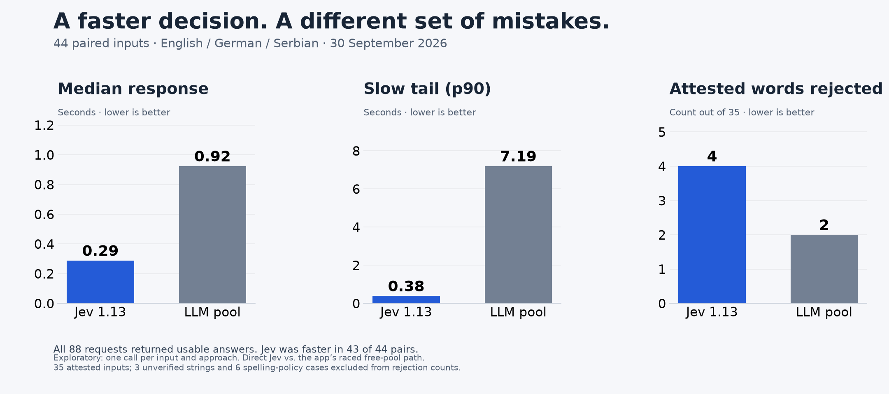

# Jev attestation experiment — 30 September 2026

A frozen 44-input exploratory comparison of TypeSafe Jev 1.13.0 and the
echo-words free-pool attestation checker. Production behavior is unchanged.



## Evidence

- `manifest.json`: frozen inputs, legacy and source-audited labels, exact
  requests, source commit, harness hash, order and thresholds.
- `results.jsonl`: all 88 append-only results, including raw model output and
  reported Jev token usage. No keys are included.
- `summary.json`: reproducible numerical report. Its semantic-review flag is a
  reminder that the automatic report alone is not acceptance; the completed
  independent review is the separate document below.
- `preflight-review.md`: independent label audit completed before calls.
- `semantic-review.md`: independent review of all 44 pairs, completed 1 October.
- `provider-availability.json`: aggregate underlying provider results; racing
  means one logical pool request can make multiple provider attempts.
- `comparison.png` and `comparison.svg`: shareable chart; raw values are in the
  summary and results files.

The design fingerprint is
`ee967f80f56c61ec1575a549ad78307fee5b690e8cff7e86b0a2b17cb3efcc40`.
The recorded source commit identifies the unchanged imported production code;
the harness was new and uncommitted at measurement time, so its separate SHA-256
identifies the actual experiment code.

## What can be claimed

Both approaches produced 44 usable answers. Jev was faster in 43 pairs; median
check times were 0.288 versus 0.923 seconds. It rejected four of 35 independently
source-backed positives, compared with two for the pool. This is a small
one-shot comparison of approaches, not a controlled architecture benchmark.

Three alleged negatives were found to be attested before any measured call:
`bookshelfy`, `tablewards`, `Fahrradsuppe`. The remaining three challenge strings
are unverified, and the six typo cases are spelling-policy examples. Do not
calculate overall accuracy from the legacy labels. Independent agent source
review is not a claim that a human validated every word.

There were 92 underlying pool attempts: 45 successful, 43 superseded by a race,
two errors and two HTTP 429s. No logical pair was missing; Gemini remained active.
The pool's winners were Groq 21, Gemini 17, Nemotron 5, Laguna 1. Different output
contracts, service routing and model mixtures limit the comparison.

Jev's 15,764 reported input tokens imply **$0.000662088** at the published input
price. This is an estimate, not a bill. A separate 294-token connection probe is
excluded. The comparison does not save API dollars against the free pool.

The preregistered exploratory uncertainty band would defer 18/44 inputs. No
threshold was tuned from the answers. These data do not establish calibration,
stable performance, or a safe production policy.

## Reproduce without making API calls

From the repository root with the existing project environment:

```bash
uv run python experiments/jev_attestation_bench.py report \
  --out experiments/results/jev-attestation-20260930
uv run pytest tests/test_jev_attestation_bench.py -q
```

The reporter checks the frozen manifest against current prompts and fixtures;
it refuses to blend a different design with these results. The benchmark's pool
arm calls `one_note_bench.run_batch`, preserving its production prompt, stream
handling and race behavior.

## Run another measurement

This spends real provider quota. Decide fixtures, available pool budget and
evaluation criteria first. Load a TypeSafe key as `TYPESAFE_API_KEY` and the
normal pool credentials through the existing benchmark key loader. Never put
keys in the result bundle.

```bash
uv run python experiments/jev_attestation_bench.py prepare \
  --out experiments/.bench-jev-next
uv run python experiments/jev_attestation_bench.py run \
  --out experiments/.bench-jev-next
uv run python experiments/jev_attestation_bench.py report \
  --out experiments/.bench-jev-next
```

`run` always resumes the first usable answer per input and arm. It stops when
Jev is unavailable or the pool misses twice consecutively. Do not restart an
exhausted run, and do not report quality until availability has been inspected.
The generated review packet needs a fresh agent's all-item semantic review.

## References

- [TypeSafe model and pricing documentation](https://docs.typesafe.ai/models)
- [Noul response semantics](https://docs.typesafe.ai/primitives/noul)
- [Durable experiment decision](../../../spec/decision-jev-attestation.md)
- [Independent semantic review](semantic-review.md)
